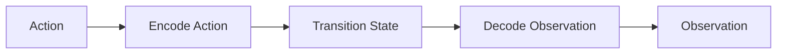

# WorldKernels Architecture

WorldKernels is a GPU-first simulation engine for serving learned world models as stateful interactive sessions. Conceptually, it applies vLLM-style cache and scheduling ideas to world simulation instead of text generation.

## Design Principles

-   :material-layers-triple:{ .lg .middle } __Stage-Decomposed Execution__

    ---

    World models are executed as three stages: action encoding, state transition, and observation decoding.

-   :material-memory:{ .lg .middle } __Stateful Session Runtime__

    ---

    Sessions own latent state, support checkpoint/branch/restore, and are scheduled as GPU resources.

-   :material-flash:{ .lg .middle } __Performance-First__

    ---

    Runtime design prioritizes buffer reuse, minimal transfers, and optimized backend selection.

-   :material-puzzle:{ .lg .middle } __Extensible Adapters__

    ---

    New world models and backends are integrated via adapters and plugin-style registration.

## Runtime Topology

At a high level, the system is split into controller, runtime, and serving layers:

- `core/`: user-facing engine, sessions, action/observation/config primitives, and errors
- `worlds/`: abstract world interface, adapters, and world registry
- `runtime/`: executor hot path, memory/cache manager, scheduler, metrics, and backend dispatch
- `serving/`: HTTP and WebSocket API surface
- `cli/`: command-line entry points

## Core Modules

### Engine and Session

`WorldKernel` orchestrates model lifecycle and session creation. A `Session` manages:

- `session_id`
- latent state ownership
- monotonic step index
- lifecycle transitions (active, paused, terminated)

Session operations include `step`, `checkpoint`, `branch`, `restore`, and `close`.

### World Interface

All adapters implement the staged interface in `worlds/base.py`:

1. `encode_action(action)`
2. `transition(state, action_encoded)`
3. `decode_observation(state, modalities)`

This keeps execution policy in runtime while model-specific logic stays in adapters.

### Runtime Components

- `runtime/executor.py`: executes staged world calls on selected backend
- `runtime/scheduler.py`: admission control and session scheduling
- `runtime/memory.py`: VRAM accounting and latent cache lifecycle
- `runtime/metrics.py`: metric emission for observability
- `runtime/backends/`: eager and compiled backends

## Data Flow

For each session step, the runtime keeps state on-device when possible, performs transition, and decodes only requested modalities.

## Serving Surface

The serving layer exposes session-centric APIs in `serving/routes.py` and streaming support in `serving/websocket.py`. Expected endpoints include:

- world load/list/unload
- session create/list/get/delete
- session step/checkpoint/restore/branch
- metrics and health

## Extension Points

Common extension paths:

- Add a new world adapter in `worlds/adapters/`
- Register adapters via `worlds/registry.py` and package entry points
- Add backend behavior in `runtime/backends/`
- Add telemetry in `runtime/metrics.py`

When extending architecture, keep data paths explicit and avoid introducing parallel implementations of existing operations.
